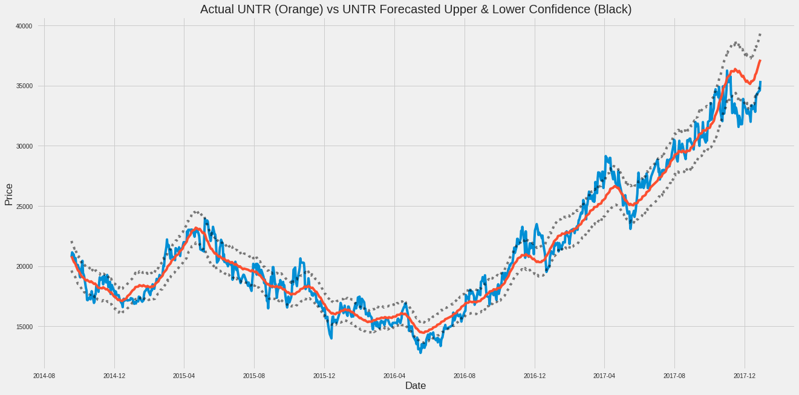
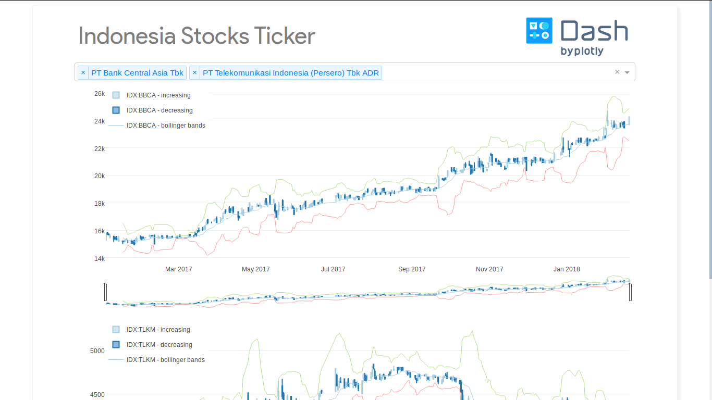

# Stock Ticker and Stock Prediction for Indonesian Company

Stock Ticker ID are notebooks for stock prediction and stock ticker app using [Dash](https://plot.ly/dash) for creating dashboard of Indonesian company

## Preview
### stock-prediction


### stock-ticker-id



## Installation

OS X, Linux and Windows:

Clone this repository

### stock-prediction 
```sh
cd stock-prediction
pip install -r requirement.txt
jupyter notebok
```

### stock-ticker-id 
```sh
cd stock-ticker-id
pip install -r requirement.txt
python app.py
```

## Meta

Doni Rubiagatra – [@rubiagatra](https://twitter.com/rubiagatra) – rubiagatra@gmail.com

Distributed under the MIT license. See ``LICENSE`` for more information.


## Contributing

1. Fork it (<https://github.com/rubiagatra/ner-suara-surabaya/fork>)
2. Create your feature branch (`git checkout -b feature/fooBar`)
3. Commit your changes (`git commit -am 'Add some fooBar'`)
4. Push to the branch (`git push origin feature/fooBar`)
5. Create a new Pull Request
The following is a screenshot for the app in this repo:

